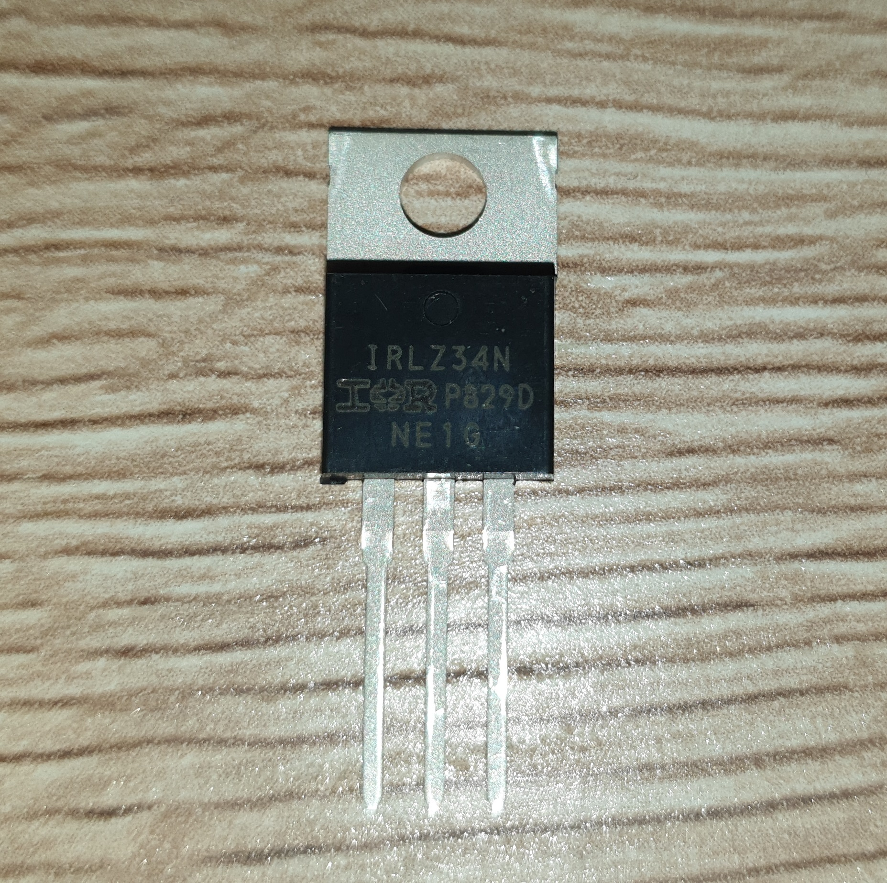

# Aplikace
## Použití
Program je vytvořený v jazyku Python - tzn. řed použitím je potřeba jej nainstalovat. Program je vytvořený ke kontrole jednobarevného LED pásku sloužícího jako osvětlení akvária.


## Funkce
- Časované vypnutí a rožnutí světla.
- Plynulé zhasínání a rožínání světla (Fade effect).
- Nastavení intenzity svícení.
- Uložení data poslední výměny vody / čištění akvária.

## Potřebné knihovny
1. **Pigpio** - Knihovna určená k ovládání LED (https://abyz.me.uk/rpi/pigpio/download.html)
2. **Guizero** - Knihovna určená k vytvoření okna aplikace (https://lawsie.github.io/guizero/)

## Před prvním spuštěním
**Nastav souboru chmod:**
- chmod a+x akvarium.py

**Nastav v nastavení:**
- Preference -> Rpi configuration -> interfaces -> 1-Wire Enabled

**Spusť pigpiod**
- Do terminálu napiš příkaz: **sudo pigpiod**

## Po každém restartování RPi
**Po každém restartování Rpi napiš příkaz do terminálu:**
- sudo pigpiod

## Nastavení aplikace - array data
```
saved_data [
automatické světlo 	| 1 / 0
stmívání		| 1 / 0
délka stmívání		| 3 - 3600 (sekundy)
síla světla		| 0 - 255
start světla		| 0 - 24 (hodiny)
start světla		| 0 - 59 (minuty)
délka svícení		| 0 - 23 (hodiny)
voda vyměněna		| datum
]
```
# Zapojení LED světla
## Výsledek


## Diagram zapojení

## Zapojení na fotce

## Použité součástky ke kontrole LED pásků
###### Nepájivé pole

###### Svorka na DPS 2 piny 2.54mm

###### IRLZ34N (Unipolární tranzistor, N kanál, THT, 55V, 30A, 68W, TO220AB IRLZ34N)

###### Kabely


