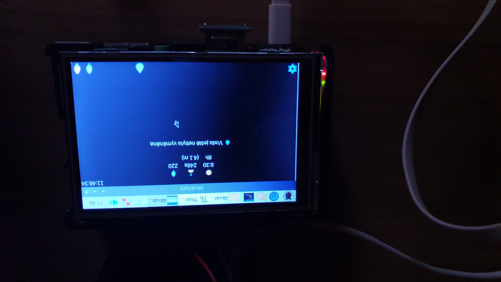
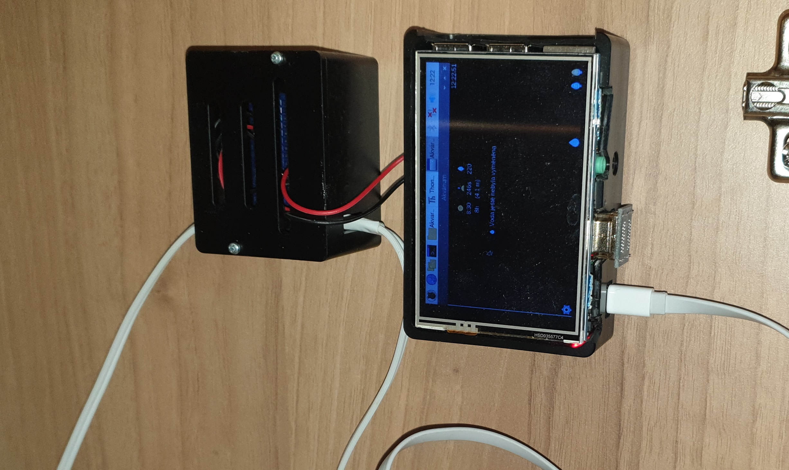
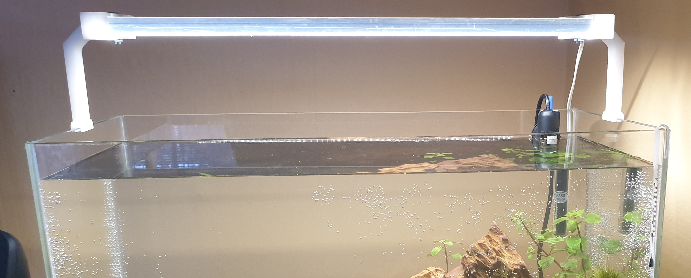
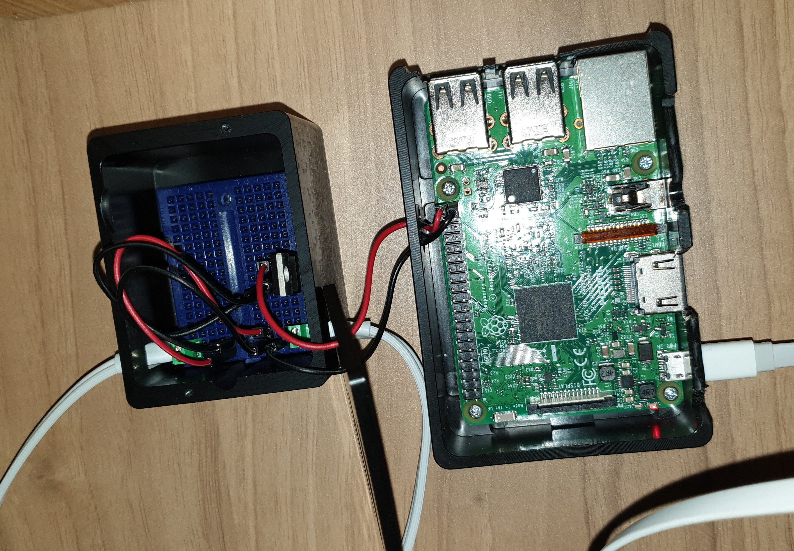
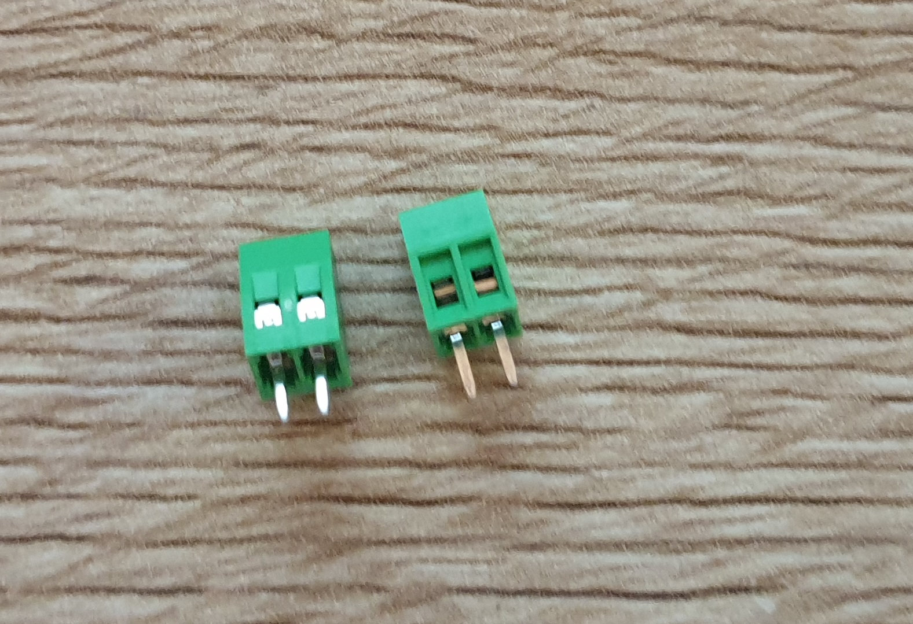

# Application
## Description
The program is created in Python language - ie. it needs to be installed before use. The program is created to control a one-color LED strip serving as aquarium lighting.


## Program functions
- Timed light on and off.
- Smooth switching off and switching on the light (Fade effect).
- Adjusting the light intensity.
- Save the date of the last water change / aquarium cleaning.
- All settings is directly in the program.

## Necessary libraries
1. **Pigpio** - LED control library (https://abyz.me.uk/rpi/pigpio/download.html)
2. **Guizero** - Library for creating window app (https://lawsie.github.io/guizero/)

## Before the first run
**Set the chmod of file:**
- chmod a+x akvarium.py

**Set in settings:**
- Preference -> Rpi configuration -> interfaces -> 1-Wire Enabled

**Run pigpiod**
- Write a command to the terminal: 
```
sudo pigpiod
```

## After each RPi restart
**After each restart of Rpi, write a command to the terminal:**
```
sudo pigpiod
```

## Application settings - array data
```
saved_data [
Automatic light		| 1 / 0
Fade effect		| 1 / 0
Dimming effect time	| 3 - 3600 (seconds)
Light brightness	| 0 - 255
Start of lighting up	| 0 - 24 (hours)
Start of lighting up	| 0 - 59 (minutes)
Lighting length		| 0 - 23 (hours)
Water change date	| date
]
```
# LED light connection
## Result



## Wiring diagram

## Wiring on photo

## Used components for controling LED strips
###### Breadboard

###### 2 pin clamp 2.54mm

###### IRLZ34N (Unipolar transistor, N channel, THT, 55V, 30A, 68W, TO220AB IRLZ34N)

###### Cables

